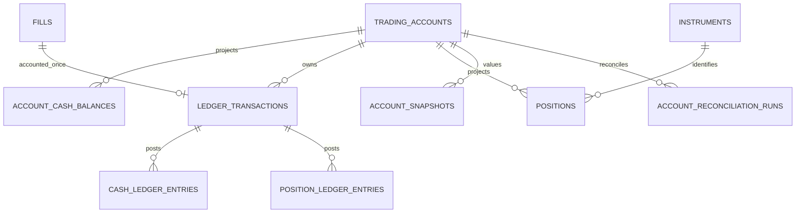

# 模拟账户与只追加账本

> B01-C 的网页和 API 只展示 M04 权威投影；模拟成交后会刷新现金、持仓、快照与核对，但前端不自行计算或修改账本。

> B01-B 复用 `FillAccountingService.apply_in_uow`，把模拟 Fill 与 M04 资金、持仓、两类账本、快照和
> 核对放入同一个外层 PostgreSQL 事务。记账公式和幂等原则未改变；详见
> [模拟执行事实管道](simulated_execution_pipeline.md)。

> M05 边界：创建、确认、取消、过期、Command 和 Outbox 均不得修改 CashBalance、Position、两类账本、Fill、AccountSnapshot 或 Reconciliation。Order 不是成交，QUEUED 不冻结资金或持仓。

M04 只实现本地 `SIMULATED` 账户。PostgreSQL 中的 `ledger_transactions`、`cash_ledger_entries` 与 `position_ledger_entries` 是不可变业务事实；`account_cash_balances` 和 `positions` 是可重建投影。Redis 不保存权威资金或持仓。

`LedgerTransaction` 是一次业务记账的原子边界，使用全局唯一 `business_key`，成交交易还使用唯一 `related_fill_id`。每笔资金变化追加一条净额 `CashLedgerEntry`，每笔持仓变化追加一条 `PositionLedgerEntry`。分录记录变化量和变化后的余额，便于追查与重算。账户创建、入金、出金和成交均在一个数据库事务内更新投影、追加账本、领域事件和审计记录。

## 成交公式

设成交数量为 `q`、成交价为 `p`，费用 `f = commission + tax + other_fee`：

- 毛额：`gross = q × p`。
- 买入净支出：`buy_net = gross + f`。
- 卖出净收入：`sell_net = gross - f`。
- 买入后成本：`new_cost = old_cost + buy_net`。
- 移动加权平均成本：`new_average = new_cost / (old_quantity + q)`。
- 卖出移除成本：`removed_cost = old_average × q`。
- 卖出已实现盈亏：`realized_delta = sell_net - removed_cost`。
- 卖出后成本：`new_cost = old_cost - removed_cost`；清仓后成本和平均成本归零。

买入费用计入成本，卖出费用从收入扣除。服务使用 `Decimal` 重算并核对 Fill 已存毛额和净额，容差为 `0.00000001`。

## 幂等、并发与拒绝

账户创建和资金操作使用调用方幂等键；Fill 以 `related_fill_id` 和 `fill:{id}` 双重唯一。并发记账固定先锁账户币种资金行，再锁账户/标的持仓行。余额和持仓带 `row_version`。资金不足拒绝买入或出金；可用持仓不足拒绝卖出；不会产生负余额或超卖分录。

`IMMEDIATE` 下买入数量立即进入可用持仓。`T_PLUS_ONE` 仅把买入记入待结算数量；M04 尚无跨日结算任务，因此 Demo 默认使用 `IMMEDIATE`。更正不得删除历史分录，未来只能用反向交易和新分录纠正。

M04 本身不包含模拟撮合、订单状态流转服务、MiniQMT/XtQuant、真实成交接入或真实资金动作；B01-B
只在外层服务中复用其成交记账能力。开发 CLI 生成的 Order/Fill 必须带 `DEMO` 和 `synthetic`
元数据。

## M04 ER 增量

