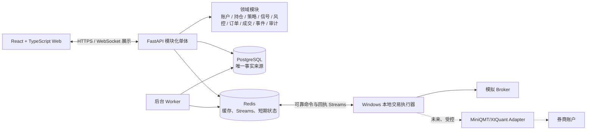
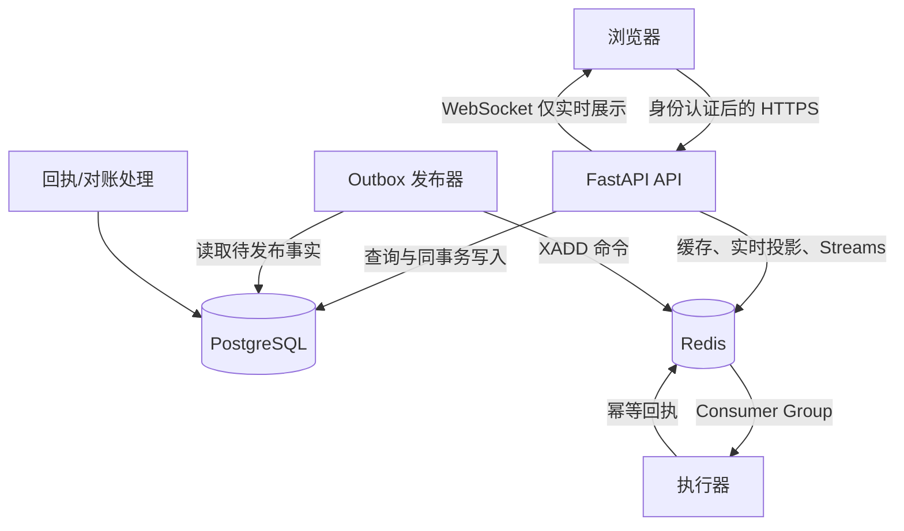
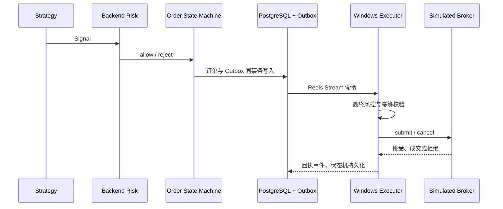
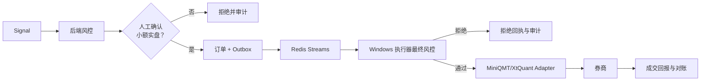
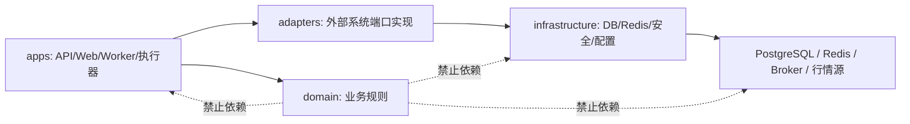
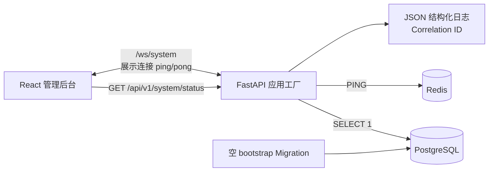

# 架构总览

> M04 架构增量：FastAPI 应用服务在单个 PostgreSQL 事务内追加资金/持仓账本并更新投影；估值复用 M03 行情查询；Redis 不承载权威账户数据。详见 `accounting.md` 与 ADR 0011。

## M03 行情切片

行情切片遵守 `Web → FastAPI → 应用服务 → 领域端口 → 基础设施` 的单向依赖。PostgreSQL 保存来源、映射、K 线、同步运行、事件和审计；Redis 在 M03 仍不承载行情事实、缓存或消息。详细边界见 [market_data.md](market_data.md) 与 ADR 0008。

AlphaDesk 的 MVP 采用模块化单体：业务规则集中于单一后端代码库，并通过清晰的领域与适配器边界隔离外部依赖。Windows 执行器是独立进程和安全边界，不是 Web 后端的一个远程函数。

## 总体系统

## 前端、后端、数据与执行器关系

WebSocket 仅用于浏览器展示和订阅，不能作为交易命令可靠通道。订单和 Outbox 必须在同一个 PostgreSQL 事务中创建；Redis 或执行器短暂不可用时，事实仍保留在 PostgreSQL 中。

## 模拟盘链路

## 未来实盘链路

## 依赖方向

领域模块通过抽象端口表达所需能力；具体 Broker、FastAPI、Redis 与数据库实现只能位于应用、适配器或基础设施层。

## M01 已实现边界

M01 只实现应用外壳与依赖探测：

- `/health/live` 只验证进程，不访问 PostgreSQL 或 Redis。
- `/health/ready` 对两个关键依赖执行有超时的检查，失败返回 503。
- `/api/v1/system/status` 只返回脱敏后的服务状态、版本、环境和链路 ID。
- `/ws/system` 仅验证实时展示连接，不发送 Signal、订单或执行器命令。
- M01 封板时 SQLAlchemy metadata 为空；Redis Streams、Outbox 发布和交易流程均未实现。

## M01.1 运行时验收结论

M01 当前的可运行拓扑已通过真实 Docker Compose 验证：浏览器只访问宿主机回环地址上的 Web 与 API；PostgreSQL 和 Redis 不发布宿主机端口，只能由 Compose 内部网络访问。API 和 Web 均以非 root 用户运行，API 启动前执行幂等的 `alembic upgrade head`。

`/health/live` 与 `/health/ready` 的分离在故障注入中得到验证：依赖中断不会伪装成 API 进程死亡，但会阻止就绪；前端通过系统状态接口展示降级，并通过有上限退避的 WebSocket 重连恢复展示连接。PostgreSQL 的 `alembic_version` 与 Redis AOF 数据均能跨整组容器重启保留在命名卷中。

这些是 M01.1 封板时的运行时结论。M02 随后增加了 PostgreSQL 领域表，但 Redis 仍未启用 Streams，WebSocket 仍不承载交易命令，既有运行边界没有改变。

## M02 领域与持久化分层

M02 新增独立的 `alphadesk_domain` 纯 Python 包，以及位于 `alphadesk_api.infrastructure` 的 SQLAlchemy Model、Mapper、Repository 和 Unit of Work。依赖只允许从 API/基础设施指向领域协议；领域包不得导入 FastAPI、SQLAlchemy、Redis、XtQuant 或具体 Broker。PostgreSQL 现包含 18 张核心表，结构见 `database_schema.md`。

这一阶段没有增加公开业务 API、网页功能、Redis Streams、Outbox 发布器、订单状态机服务、风控执行或 Broker 调用。Web 与既有健康接口的 M01 行为保持不变。
