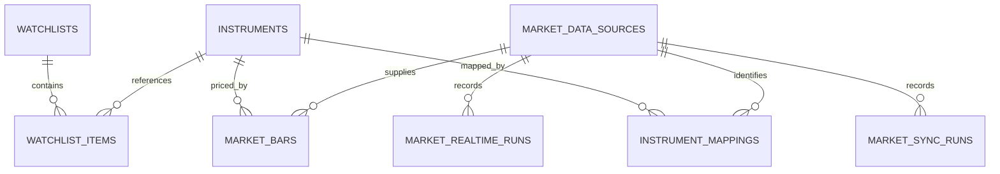
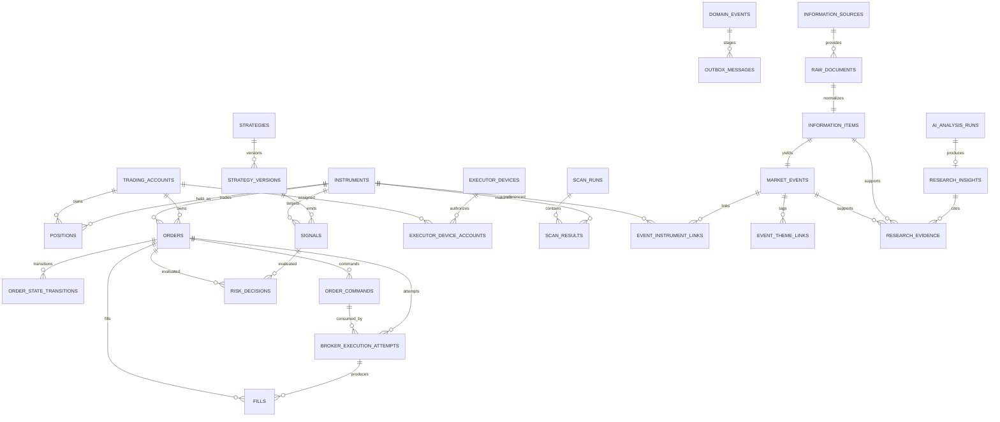

# PostgreSQL 持久化模型

## D02 市场参考事实

- `trading_calendar_sessions`：SHSE/SZSE 日期、开放状态、前后开放日和来源，唯一键 exchange + session_date。
- `adjustment_factors`：Instrument、交易日、Decimal 因子、约定和来源，按业务键幂等。
- `instrument_trading_statuses`：TRADING/SUSPENDED/RESUMED/UNKNOWN 日状态。
- `instrument_lifecycle_events`：上市、退市、长期停牌、恢复与状态变化事实。
- `instruments` 增加 listed_at/delisted_at；StrategyRun、ScanRun、BacktestRun、ReplayRun 以 RAW 默认保存最小必要价格模式字段。

Migration `0017_d02` 继承唯一 head `0016_rt01`。

> RT01 Migration `0016_rt01`（唯一前驱 `0015_bt01`）新增 `replay_runs`、
> `replay_control_actions`、`replay_events`、`replay_equity_points`。Run 保存配置快照、Session 游标、
> 版本与 Worker lease；控制动作和事件追加写入并有稳定幂等/序号约束。Signal、RiskDecision、
> Order、Fill 与账本继续复用既有事实表，不建立第二套交易事实。

> BT01-R Migration `0015_bt01`（唯一前驱 `0014_d01`）新增 `backtest_runs`、`backtest_equity_points`、`backtest_metrics`、`backtest_trade_summaries` 与追加式 `backtest_events`。Run 通过 `strategy_run_id`、`account_id` 和 `correlation_id` 复用既有 Signal、RiskDecision、Order、Fill 与 M04 账本事实；不复制第二套交易事实表。指标 warnings 使用 JSONB，金额与比例使用 NUMERIC。

> N01 Migration `0012_n01` 新增资讯来源、摄取运行、RawDocument、InformationItem、MarketEvent 和 Instrument/主题关联表。原始文档按同来源 external ID 和规范内容 SHA-256 去重；每个 InformationItem 至多一个 MarketEvent；confidence/importance 使用 NUMERIC。

> SC01 Migration `0011_sc01` 新增 `scan_runs` 与追加式 `scan_results`。运行幂等键唯一；结果对 `(scan_run_id, instrument_id)` 和 `(scan_run_id, rank)` 唯一，rank 从 1 开始，评分与参考价使用 NUMERIC。Scanner 只读取既有 MarketBar，不写入 Signal、风控、订单、成交或账本表。

> B01-B Migration `0010_b01` 新增只追加 `broker_execution_attempts`，并扩展 Fill 的 Attempt、
> Command、连续序号和稳定执行引用。Command 新增明确的本地 `CONSUMED` 事实；Outbox 新增
> `SUPPRESSED` 及固定抑制原因，避免本地模拟成交命令未来被 Publisher 外发。Attempt、Fill、M04
> 账本、Order/Transition、事件、审计、Command 和 Outbox 在同一事务提交。

> Migration `0009_r01` 扩展 `risk_decisions` 为可幂等查询的聚合决策事实，并新增只追加 `risk_rule_evaluations`。逐规则表约束 `(risk_decision_id, seq)` 与 `(risk_decision_id, rule_key)` 唯一；人工 PASS 的订单外键采用延迟校验，以支持与 M05 初始订单事实同事务提交。

> S02-B1 新增 `strategy_experiments` 和只追加的 `strategy_experiment_runs`。前者保存
> 规范参数网格、范围、状态和汇总；后者以唯一组合序号连接既有 `strategy_runs`，并对
> `strategy_run_id` 与子幂等键建立唯一约束。结构由 Migration 0008 管理。

> S01-B Migration `0007_s01` 新增 `strategy_runs`，并扩展既有 `signals` 以记录运行 ID、连续序号、稳定策略键/版本、K 线时间、置信度、元数据和 schema 版本。研究 Signal 的账户与数据库策略外键允许为空；`(strategy_run_id, sequence_number)` 唯一。运行成功时 StrategyRun 与全部 Signal 原子提交，失败时回滚后以独立短事务只记录 FAILED 运行。

> M05 的 `0006_m05` 扩展 Order 版本/确认字段，增加 `order_actions`，并补齐 Command 的 `SUBMIT_ORDER/PENDING` 约束和每订单唯一提交命令索引。确认的全部事实与 Outbox 在同一事务提交；账本、Position 与 Fill 表不被修改。

> M05-A订单领域模型、状态机和持久化基础已完成；M05应用服务、Transactional Outbox、API、前端和并发验收尚未完成。

> `order_state_transitions.action_id` is the authoritative optional foreign key to `order_actions.id`. `order_actions.applied_transition_id` is a nullable lookup ID rather than a foreign key, so an action can be appended before its state transition without a circular-insert dependency.

> M04.1A Migration `0005_m04_1_free_market_data.py` 为 `market_data_sources` 增加 provider tier、quote/近期分钟线能力和健康检查时间，并新增 `market_realtime_runs`。实时 quote 不持久化到 PostgreSQL；其 Redis 结构见 [free_market_worker.md](free_market_worker.md)。

> Migration `0004_m04` 新增 `account_cash_balances`、`ledger_transactions`、`cash_ledger_entries`、`position_ledger_entries`、`account_snapshots`、`account_reconciliation_runs`。账本只追加，余额与持仓是带行版本的投影。

## M03 行情增量

| 表 | 角色 | 关键约束与索引 |
| --- | --- | --- |
| `market_data_sources` | 行情来源目录与优先级 | `source_code` 唯一；状态、非负优先级、非空周期数组受约束 |
| `instrument_mappings` | 内部标的与来源代码映射 | `(source_id, external_symbol)` 与 `(source_id, instrument_id)` 唯一；外键 `RESTRICT` |
| `market_bars` | 规范化 OHLCV K 线事实 | 标的/来源/周期/复权/时间唯一；正价格、OHLC、非负数量约束；时间降序复合索引 |
| `market_sync_runs` | 每次同步请求和计数终态 | 状态/触发类型/周期受约束；计数非负；按来源、状态、开始时间检索 |
| `market_realtime_runs` | 免费实时摄取运行摘要 | 来源、状态、触发类型和计数受约束；按来源、状态、开始时间索引；不保存 Quote payload |

`watchlists.name` 从 M03 起唯一；删除列表对条目使用 `CASCADE`，但标的、来源、映射和 K 线外键继续 `RESTRICT`。

M02 在 PostgreSQL 中建立核心领域事实、审计和可靠消息准备表。PostgreSQL 是业务事实唯一来源；Redis 仍不承载事实，也未在 M02 建立 Streams、发布器或消费者。

## 设计原则

- 领域实体位于纯 Python 包 `alphadesk_domain`；SQLAlchemy 模型与映射位于 API 基础设施层，领域层不依赖 FastAPI、SQLAlchemy、Redis 或 Broker。
- 主键采用 UUID；`domain_events.sequence` 使用数据库递增序号辅助稳定排序。
- 金额、价格、数量和费用使用 `NUMERIC`/`Decimal`，禁止使用二进制浮点数表达交易数值。
- 所有业务时间使用带时区的 `TIMESTAMPTZ`，应用边界只接受 aware datetime，并统一规范为 UTC。
- 可扩展参数、事件载荷和审计前后值使用 `JSONB`；稳定、需要约束或查询的字段必须保持为结构化列。
- 外键删除策略以 `RESTRICT` 为主。交易事实和历史记录不依赖级联删除，数据清理必须走未来的明确归档策略。
- 约束、外键和索引使用稳定名称，数据库结构只能由 Alembic Migration 演进。

## 表清单

| 表 | 角色 | 关键唯一性、约束与索引 |
| --- | --- | --- |
| `instruments` | 标的主数据 | `(exchange, symbol)` 唯一；最小交易单位和价格步长为正；按市场/启用状态检索 |
| `watchlists` | 自选列表 | UUID 主键；名称与描述为可变展示信息 |
| `watchlist_items` | 自选列表成员 | `(watchlist_id, instrument_id)` 唯一；排序非负；按列表和排序检索 |
| `trading_accounts` | 受管理账户元数据 | `account_code` 唯一；账户类型、状态受枚举约束；不保存券商凭证 |
| `positions` | 账户标的仓位快照 | `(account_id, instrument_id)` 唯一；数量非负且可用量加冻结量不超过总量；行版本为正 |
| `strategies` | 策略稳定身份 | `strategy_code` 唯一；状态受枚举约束 |
| `strategy_versions` | 不可变策略版本 | `(strategy_id, version_number)` 唯一；每个策略至多一个 active 版本（部分唯一索引） |
| `signals` | 策略产生的交易意图 | 类型、方向、状态受约束；数量/价格为正；有效期晚于生成时间；按策略时间和账户标的检索 |
| `executor_devices` | Windows 执行器登记信息 | `device_code` 唯一；状态受约束；只保存公钥指纹/能力等非秘密信息 |
| `executor_device_accounts` | 设备与账户授权关系 | `(device_id, account_id)` 复合主键；权限受枚举约束 |
| `orders` | 订单聚合当前状态 | `idempotency_key` 唯一；数量、成交量、限价订单价格和状态受约束；按账户、状态、关联 ID 检索 |
| `order_state_transitions` | 订单状态迁移历史 | append-only；起止状态受约束；按订单发生时间及关联 ID 检索 |
| `order_commands` | 待交付执行器的命令事实 | `command_id` 唯一；序号非负、有效期晚于创建时间；按订单序号和目标设备/状态检索 |
| `broker_execution_attempts` | 本地模拟 Broker 的追加式执行尝试 | 幂等键、订单/命令尝试序号唯一；数量守恒；按账户、结果、关联 ID 检索 |
| `fills` | Broker 成交事实 | Broker 引用、Attempt 序号和执行引用唯一；数量/价格为正、费用非负；按订单时间及账户标的检索 |
| `risk_decisions` | 风控判定事实 | Signal 或 Order 至少关联一个；层级和决定类型受约束；按目标与关联 ID 检索 |
| `domain_events` | 统一领域事件日志 | `event_id` 主键；schema 版本为正；按实体序列、事件时间和关联 ID 检索 |
| `audit_logs` | 关键操作审计日志 | append-only；记录 actor、动作、原因、前后值与结果；按资源时间和关联 ID 检索 |
| `outbox_messages` | 与业务事实同事务写入的待发布记录 | `(event_id, topic)` 唯一；状态和重试次数受约束；按待处理状态/可用时间及聚合检索 |
| `scan_runs` | 历史日线扫描运行 | `idempotency_key` 唯一；DAY_1、状态、非负计数和 SHA-256 指纹受约束 |
| `scan_results` | 追加式规则匹配结果 | 运行/标的与运行/rank 唯一；rank、score、参考价和 schema 版本受约束 |
| `information_sources` | 手工/RSS等来源目录 | `source_key` 唯一；来源类型受约束；不保存凭据 |
| `information_ingestion_runs` | RSS手工摄取运行 | 状态与非负计数受约束；按来源/开始时间检索 |
| `raw_documents` | 不可覆盖的来源原文 | 来源/external ID 与规范内容 SHA-256 唯一；按来源、发布/接收时间检索 |
| `information_items` | 规范化可搜索资讯 | RawDocument 一对一；状态受约束；区分发布与接收时间 |
| `market_events` | 确定性或用户指定事件 | InformationItem 一对一；类型、方向、重要度和 schema 版本受约束 |
| `event_instrument_links` | 事件标的关联 | 事件/Instrument 复合主键；Decimal confidence 0–1 |
| `event_theme_links` | 事件主题关联 | 事件/theme key 复合主键；按主题检索 |
| `ai_analysis_runs` | AI 研究运行与审计状态 | `idempotency_key` 唯一；请求指纹、状态、Prompt 版本、Token/成本和输入 ID 受约束 |
| `research_insights` | 追加式结构化 AI 研究输出 | 每个 AnalysisRun 至多一个；重要度 0–100、置信度 0–1、schema 版本受约束 |
| `research_evidence` | Insight 的来源证据 | 每条证据只能关联 InformationItem 或 MarketEvent 之一；证据文本长度受限 |

## 关系概览

## 可变状态与追加事实

`order_state_transitions`、`broker_execution_attempts`、`fills`、`risk_decisions`、`domain_events` 和
`audit_logs` 只允许追加，不提供仓储级更新/删除方法。`outbox_messages` 只在受控服务中更新投递或
抑制状态，其业务载荷及关联事件身份不应原地改写。`orders`、`positions` 等当前状态表可以在受控
应用服务事务中更新，同时写入对应历史、事件和审计事实。

## 事务边界

应用服务通过一个 Unit of Work 共享同一异步 Session。仓储只 `flush`，不得自行 `commit`。B01-B
外层服务统一提交 Attempt、订单状态/迁移、Fill、M04 投影与账本、快照、核对、领域事件、审计、
Command 消费和 Outbox 抑制；任一步失败则整体回滚。回滚后的新事务必须仍可正常使用。

M02 只建立模型、持久化和事务能力。Outbox 发布、Redis Streams、订单状态机服务、风控执行、Broker/执行器通信以及业务 API 均属于后续里程碑。
