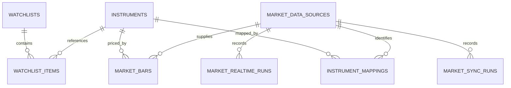
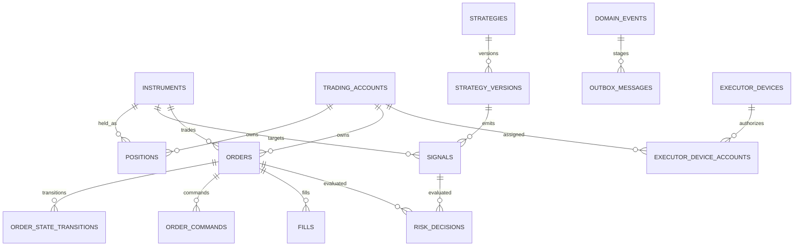

# PostgreSQL 持久化模型

> M05-A订单领域模型、状态机和持久化基础已完成；M05应用服务、Transactional Outbox、API、前端和并发验收尚未完成。

> `order_state_transitions.action_id` is the authoritative optional foreign key to `order_actions.id`. `order_actions.applied_transition_id` is a nullable lookup ID rather than a foreign key, so an action can be appended before its state transition without a circular-insert dependency.

> M04.1A Migration `0005_m04_1_free_market_data.py` 为 `market_data_sources` 增加 provider tier、quote/近期分钟线能力和健康检查时间，并新增 `market_realtime_runs`。实时 quote 不持久化到 PostgreSQL；其 Redis 结构见 [free_market_worker.md](free_market_worker.md)。

> Migration `0004_m04` 新增 `account_cash_balances`、`ledger_transactions`、`cash_ledger_entries`、`position_ledger_entries`、`account_snapshots`、`account_reconciliation_runs`。账本只追加，余额与持仓是带行版本的投影。

## M03 行情增量

| 表 | 角色 | 关键约束与索引 |
| --- | --- | --- |
| `market_data_sources` | 行情来源目录与优先级 | `source_code` 唯一；状态、非负优先级、非空周期数组受约束 |
| `instrument_mappings` | 内部标的与来源代码映射 | `(source_id, external_symbol)` 与 `(source_id, instrument_id)` 唯一；外键 `RESTRICT` |
| `market_bars` | 规范化 OHLCV K 线事实 | 标的/来源/周期/复权/时间唯一；正价格、OHLC、非负数量约束；时间降序复合索引 |
| `market_sync_runs` | 每次同步请求和计数终态 | 状态/触发类型/周期受约束；计数非负；按来源、状态、开始时间检索 |
| `market_realtime_runs` | 免费实时摄取运行摘要 | 来源、状态、触发类型和计数受约束；按来源、状态、开始时间索引；不保存 Quote payload |

`watchlists.name` 从 M03 起唯一；删除列表对条目使用 `CASCADE`，但标的、来源、映射和 K 线外键继续 `RESTRICT`。

M02 在 PostgreSQL 中建立核心领域事实、审计和可靠消息准备表。PostgreSQL 是业务事实唯一来源；Redis 仍不承载事实，也未在 M02 建立 Streams、发布器或消费者。

## 设计原则

- 领域实体位于纯 Python 包 `alphadesk_domain`；SQLAlchemy 模型与映射位于 API 基础设施层，领域层不依赖 FastAPI、SQLAlchemy、Redis 或 Broker。
- 主键采用 UUID；`domain_events.sequence` 使用数据库递增序号辅助稳定排序。
- 金额、价格、数量和费用使用 `NUMERIC`/`Decimal`，禁止使用二进制浮点数表达交易数值。
- 所有业务时间使用带时区的 `TIMESTAMPTZ`，应用边界只接受 aware datetime，并统一规范为 UTC。
- 可扩展参数、事件载荷和审计前后值使用 `JSONB`；稳定、需要约束或查询的字段必须保持为结构化列。
- 外键删除策略以 `RESTRICT` 为主。交易事实和历史记录不依赖级联删除，数据清理必须走未来的明确归档策略。
- 约束、外键和索引使用稳定名称，数据库结构只能由 Alembic Migration 演进。

## 表清单

| 表 | 角色 | 关键唯一性、约束与索引 |
| --- | --- | --- |
| `instruments` | 标的主数据 | `(exchange, symbol)` 唯一；最小交易单位和价格步长为正；按市场/启用状态检索 |
| `watchlists` | 自选列表 | UUID 主键；名称与描述为可变展示信息 |
| `watchlist_items` | 自选列表成员 | `(watchlist_id, instrument_id)` 唯一；排序非负；按列表和排序检索 |
| `trading_accounts` | 受管理账户元数据 | `account_code` 唯一；账户类型、状态受枚举约束；不保存券商凭证 |
| `positions` | 账户标的仓位快照 | `(account_id, instrument_id)` 唯一；数量非负且可用量加冻结量不超过总量；行版本为正 |
| `strategies` | 策略稳定身份 | `strategy_code` 唯一；状态受枚举约束 |
| `strategy_versions` | 不可变策略版本 | `(strategy_id, version_number)` 唯一；每个策略至多一个 active 版本（部分唯一索引） |
| `signals` | 策略产生的交易意图 | 类型、方向、状态受约束；数量/价格为正；有效期晚于生成时间；按策略时间和账户标的检索 |
| `executor_devices` | Windows 执行器登记信息 | `device_code` 唯一；状态受约束；只保存公钥指纹/能力等非秘密信息 |
| `executor_device_accounts` | 设备与账户授权关系 | `(device_id, account_id)` 复合主键；权限受枚举约束 |
| `orders` | 订单聚合当前状态 | `idempotency_key` 唯一；数量、成交量、限价订单价格和状态受约束；按账户、状态、关联 ID 检索 |
| `order_state_transitions` | 订单状态迁移历史 | append-only；起止状态受约束；按订单发生时间及关联 ID 检索 |
| `order_commands` | 待交付执行器的命令事实 | `command_id` 唯一；序号非负、有效期晚于创建时间；按订单序号和目标设备/状态检索 |
| `fills` | Broker 成交事实 | `(broker_type, broker_fill_id)` 唯一；数量/价格为正、费用非负；按订单时间及账户标的检索 |
| `risk_decisions` | 风控判定事实 | Signal 或 Order 至少关联一个；层级和决定类型受约束；按目标与关联 ID 检索 |
| `domain_events` | 统一领域事件日志 | `event_id` 主键；schema 版本为正；按实体序列、事件时间和关联 ID 检索 |
| `audit_logs` | 关键操作审计日志 | append-only；记录 actor、动作、原因、前后值与结果；按资源时间和关联 ID 检索 |
| `outbox_messages` | 与业务事实同事务写入的待发布记录 | `(event_id, topic)` 唯一；状态和重试次数受约束；按待处理状态/可用时间及聚合检索 |

## 关系概览

## 可变状态与追加事实

`order_state_transitions`、`fills`、`risk_decisions`、`domain_events` 和 `audit_logs` 只允许追加，不提供仓储级更新/删除方法。`outbox_messages` 需要更新投递状态、尝试次数和错误，但其业务载荷及关联事件身份不应原地改写。`orders`、`positions` 等当前状态表可以在受控应用服务事务中更新，同时写入对应历史、事件和审计事实。

## 事务边界

应用服务通过一个 Unit of Work 共享同一异步 Session。仓储只 `flush`，不得自行 `commit`。订单当前状态、状态迁移、领域事件、审计和 Outbox 记录必须能够在一个 PostgreSQL 事务中原子提交；任一步失败则整体回滚，回滚后的 Session 不可继续复用。

M02 只建立模型、持久化和事务能力。Outbox 发布、Redis Streams、订单状态机服务、风控执行、Broker/执行器通信以及业务 API 均属于后续里程碑。
