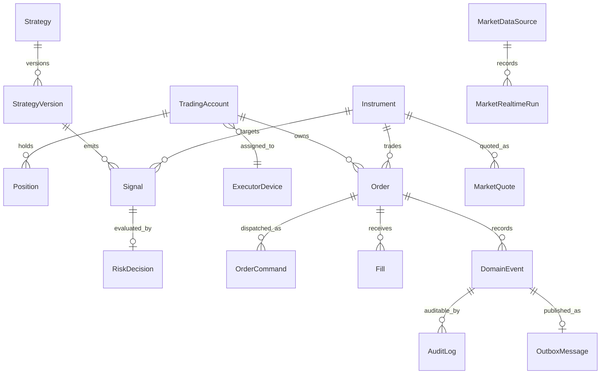

# 领域模型

> M05-A订单领域模型、状态机和持久化基础已完成；M05应用服务、Transactional Outbox、API、前端和并发验收尚未完成。

> M04.1A 新增 `MarketQuote`、`MarketQuoteSnapshot`、`MarketDataUpdate`、`MarketDataHealth`、`MarketDataCapability`、`MarketSubscriptionSet`、`MarketRealtimeRun` 与盘中估值 DTO。Quote 只存在于 Redis 临时缓存和推送链路，PostgreSQL 只保存运行摘要与历史 K 线事实。

> M04 新增领域对象：`CashBalance`、`LedgerTransaction`、`CashLedgerEntry`、`PositionLedgerEntry`、`AccountSnapshot`、`AccountReconciliationRun`；`Position` 增加成本基数、待结算数量和估值状态。

## M04.1A 免费行情领域

`MarketQuote` 使用 `Decimal` 表达价格、成交量和成交额，`quote_time` 与 `received_at` 必须是 aware datetime 并规范为 UTC。领域校验拒绝非正价格、负数量、naive datetime 和不一致的高低价；上游缺少业务时间时保留为空并标记数据不完整，不得以接收时间伪造。

`MarketSubscriptionSet` 由自选股与非零持仓解析，持仓优先；`MarketRealtimeRun` 只记录一次 Best-Effort 摄取的状态、计数和安全错误摘要。领域包仍为纯 Python，不依赖 AKShare、BaoStock、FastAPI、Redis、SQLAlchemy 或 WebSocket，具体 SDK/DataFrame/Cursor 只允许停留在 Adapter 边界。

## M03 行情领域

`MarketDataSource` 表示来源能力和优先级，`InstrumentMapping` 显式连接内部标的与外部代码，`MarketBar` 保存规范化 K 线事实，`MarketSyncRun` 记录一次摄取的生命周期与计数，`MarketDataFreshness` 是查询时计算的只读值。策略、Signal、订单和 Broker 不得依赖或绕过该边界；详细不变量见 [market_data.md](market_data.md)。

本文件定义业务概念与关系，不规定 ORM、表结构或 API 实现。所有实体的持久化事实、历史状态和审计记录以 PostgreSQL 为准。

| 对象 | 职责 | 主要关系 |
| --- | --- | --- |
| `TradingAccount` | 表示一个受管理的交易账户及其市场、权限、运行模式和风险边界 | 拥有 Position、Order；关联 ExecutorDevice |
| `Position` | 表示账户在某 Instrument 上的已确认仓位与成本基础 | 从 Fill 与对账结果投影；属于 TradingAccount |
| `Instrument` | 表示可交易标的及代码、市场、货币、交易规则和状态 | 被 Signal、Order、Fill、Position 引用 |
| `Strategy` | 表示策略的稳定身份、归属和启停状态 | 包含多个 StrategyVersion，只产生 Signal |
| `StrategyVersion` | 表示不可变的策略版本、参数、数据契约和发布信息 | 属于 Strategy；生成 Signal；被回测记录引用 |
| `Signal` | 策略或受控 AI 产生的交易意图，不是订单 | 指向 Instrument、StrategyVersion；送入风险决策 |
| `RiskDecision` | 对 Signal 或 OrderCommand 的可解释准入结果 | 关联输入、规则版本、理由及允许条件 |
| `Order` | 代表贯穿生命周期的可审计交易订单聚合 | 由获准命令创建；遵守状态机；关联 Fill |
| `OrderCommand` | 代表向执行器发出的、具有效期和幂等键的命令 | 指向一个 Order 与 `command_id`；由 Outbox 可靠投递 |
| `Fill` | 代表 Broker 报告的已成交事实 | 属于 Order；驱动 Position 投影与审计 |
| `DomainEvent` | 代表已发生且不可变的领域事实 | 关联实体、相关 ID、时间与 schema 版本 |
| `AuditLog` | 记录关键操作的谁、何时、为何、前后状态和结果 | 可关联任一领域对象和 DomainEvent |
| `OutboxMessage` | 与业务事实同事务落库、等待可靠发布的消息 | 通常承载 DomainEvent 或 OrderCommand |
| `ExecutorDevice` | 表示已登记的 Windows 执行器设备及其身份、状态和权限 | 接收 OrderCommand；可被吊销或限制 |

## 关键关系与边界

策略和 AI 均不得直接创建 Broker 请求。只有经过 RiskDecision、订单状态机与审计后的 OrderCommand 才可进入执行器命令链路。Position 是成交和对账事实的投影，不能以手工修改替代对账。

## M02 实现边界

M02 将本文件的核心概念实现为 `alphadesk_domain` 中的纯 Python dataclass、枚举、仓储协议和 Unit of Work 协议。交易数值只接受 `Decimal`，时间只接受带时区值并规范为 UTC。SQLAlchemy 模型和映射位于基础设施层，不能反向渗透到领域层。当前实现只提供模型和持久化能力，不代表策略、风控、订单状态机或执行器业务流程已经启用。
