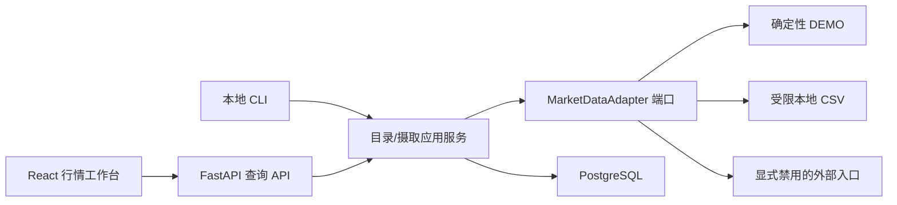

# 行情基础数据与适配器

> M04.1A 增量边界见 [免费真实行情](free_market_data.md) 与 [ADR 0012](adr/0012-free-provider-boundary.md)。M03 的 DEMO、幂等 K 线与来源优先级规则保持不变。

> M04.1A is sealed: BaoStock is historical-only and the real-time provider is `disabled`; the project is not expanding free real-time sources and awaits a later Windows Agent/MiniQMT integration.

M03 建立只读行情基础设施：标的目录、来源映射、K 线、同步运行记录、查询 API 与离线演示数据。它不包含策略、Signal、订单、风控、Broker 或交易执行。

## 边界与依赖方向

`alphadesk_domain.market` 定义纯 Python 实体和校验，`market_adapters` 定义只读端口；应用服务负责编排，SQLAlchemy 仓储和具体适配器位于基础设施层。领域层不依赖 FastAPI、SQLAlchemy、Redis 或供应商 SDK。



## 数据来源与优先级

- `DEMO`：默认启用，完全离线且确定；支持 `DAY_1`、`MINUTE_1`，供开发、CI 和验收使用。
- 本地 CSV：仅接受用户明确指定的本地普通文件，限制字节数、行数和固定列；不接受 URL，不记录文件内容。
- `EXTERNAL_DISABLED`：保留未来真实只读供应商边界，默认禁用且调用时返回受控错误；M03 没有 Token、SDK 或联网请求。
- 未指定来源时，查询从已映射的 `ACTIVE` 来源中按 `priority` 升序选择；显式来源必须存在对应标的映射。

## 规范化与幂等

应用边界把时间统一为 aware UTC，把数值转为 `Decimal`，校验 OHLC、非负成交量/成交额、周期对齐、未来时间容差以及单标的时间顺序。无映射或非法单条数据进入拒绝计数，不会污染 K 线表。

K 线业务键是 `(instrument_id, source_id, timeframe, adjustment_type, bar_time)`。批量 PostgreSQL `ON CONFLICT DO UPDATE ... WHERE changed` 区分新增、变更和未变化；相同演示导入重复运行不会新增或改写经济事实。

同步先持久化 `RUNNING` 记录；适配器失败或持久化失败后以独立事务落下 `FAILED`。成功批量写入、同步终态、领域事件和审计日志在同一事务提交。M03 不发布 Outbox，也不使用 Redis Streams。

## 新鲜度语义

- 没有 K 线为 `UNKNOWN`；来源降级为 `UNKNOWN`；数据自身质量标记优先。
- `MINUTE_1` 仅在中国市场 UTC 活跃窗口内按配置阈值判断 `DELAYED`。
- 日线和非活跃窗口不会仅因自然闭市被误报延迟。
- 页面每 30 秒刷新来源状态；K 线仍是 HTTP 快照，没有 WebSocket 行情流。

## 本地命令

```text
python -m alphadesk_api.cli.market_data seed-demo
python -m alphadesk_api.cli.market_data sync-instruments --source DEMO
python -m alphadesk_api.cli.market_data sync-bars --source DEMO --symbols 600000,000001 --timeframe DAY_1 --start 2025-01-01T00:00:00+00:00 --end 2025-12-31T00:00:00+00:00
python -m alphadesk_api.cli.market_data import-csv bars.csv --source DEMO --timeframe DAY_1 --start 2025-01-01T00:00:00+00:00 --end 2025-12-31T00:00:00+00:00
python -m alphadesk_api.cli.market_data sync-status
```

CSV 必需列为 `symbol,bar_time,open,high,low,close,volume`；可选列为 `amount,vwap,open_interest,source_updated_at`。时间必须带时区。

## HTTP API

- `GET /api/v1/instruments`、`GET /api/v1/instruments/{id}`
- `GET /api/v1/market-data/bars`
- `GET /api/v1/market-data/latest`
- `GET /api/v1/market-data/sources`
- `GET /api/v1/market-data/sync-runs`

查询有分页、标的数量和 K 线条数上限。错误使用统一信封和 Correlation ID；接口不接受供应商凭证，也没有任何交易写入口。
