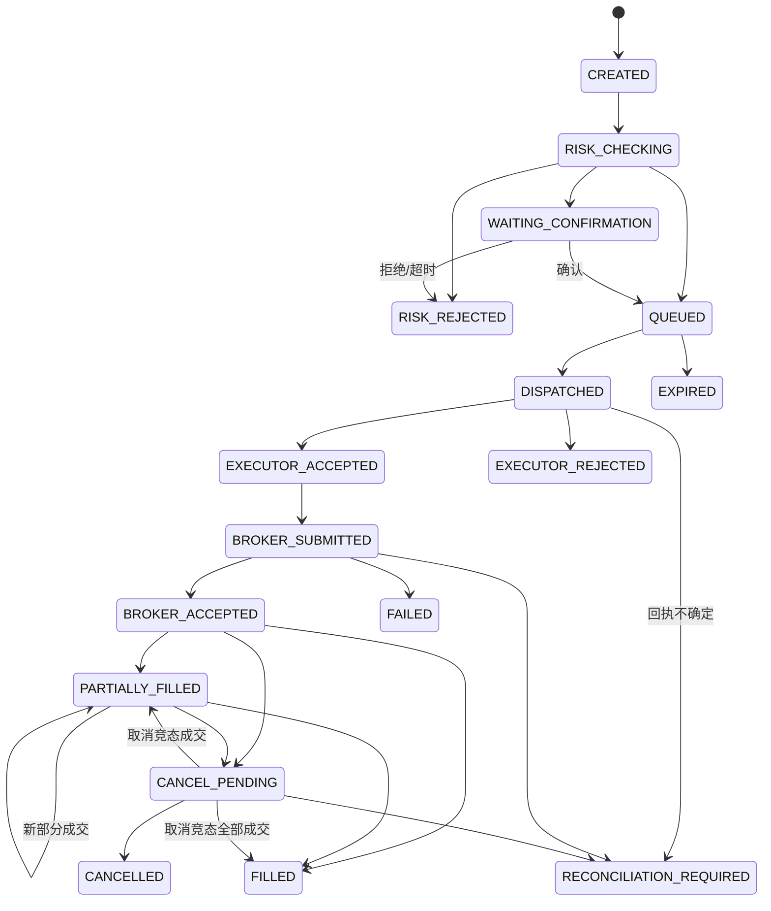

# 订单状态机

> M05 已实现：`START -> CREATED -> WAITING_CONFIRMATION`，人工确认后 `-> QUEUED`；CREATED/WAITING_CONFIRMATION 可取消或过期。QUEUED 表示本地命令事实存在，不表示已发送；终态禁止继续迁移，RECONCILIATION_REQUIRED 不是终态。详见 ADR 0015。

> M05-A订单领域模型、状态机和持久化基础已完成；M05应用服务、Transactional Outbox、API、前端和并发验收尚未完成。

所有订单必须经过此状态机。每次迁移均需原子记录原状态、新状态、UTC 时间、原因、操作主体（用户、服务或设备）和 `correlation_id`，并产生事件与审计记录。

## 状态

`CREATED`、`RISK_CHECKING`、`RISK_REJECTED`、`WAITING_CONFIRMATION`、`QUEUED`、`DISPATCHED`、`EXECUTOR_ACCEPTED`、`EXECUTOR_REJECTED`、`BROKER_SUBMITTED`、`BROKER_ACCEPTED`、`PARTIALLY_FILLED`、`FILLED`、`CANCEL_PENDING`、`CANCELLED`、`EXPIRED`、`FAILED`、`RECONCILIATION_REQUIRED`。

## 合法迁移

## 终态与约束

终态为 `RISK_REJECTED`、`EXECUTOR_REJECTED`、`FILLED`、`CANCELLED`、`EXPIRED` 与 `FAILED`。`RECONCILIATION_REQUIRED` 是受控暂停态，不是成功终态：必须通过对账获得确定结果，随后迁移到实际状态或由人工处置。

除图中箭头外的迁移均为非法，尤其禁止从任一终态回到可执行状态、从 `CREATED` 直接派发、从风险拒绝状态重试为 `QUEUED`，以及由策略/AI 直接写入 `BROKER_SUBMITTED`。取消只可从已进入 Broker 生命周期的可取消状态发起，且取消回报必须按实际成交事实处理。

## M02 持久化边界

M02 仅固化 `OrderStatus` 枚举、`orders` 当前状态和 append-only 的 `order_state_transitions` 历史结构，并验证它们可与事件、审计和 Outbox 在同一事务提交。合法迁移判定、并发状态推进、取消竞态和对账服务尚未实现；仅有数据库状态枚举约束不能替代后续状态机应用服务。
