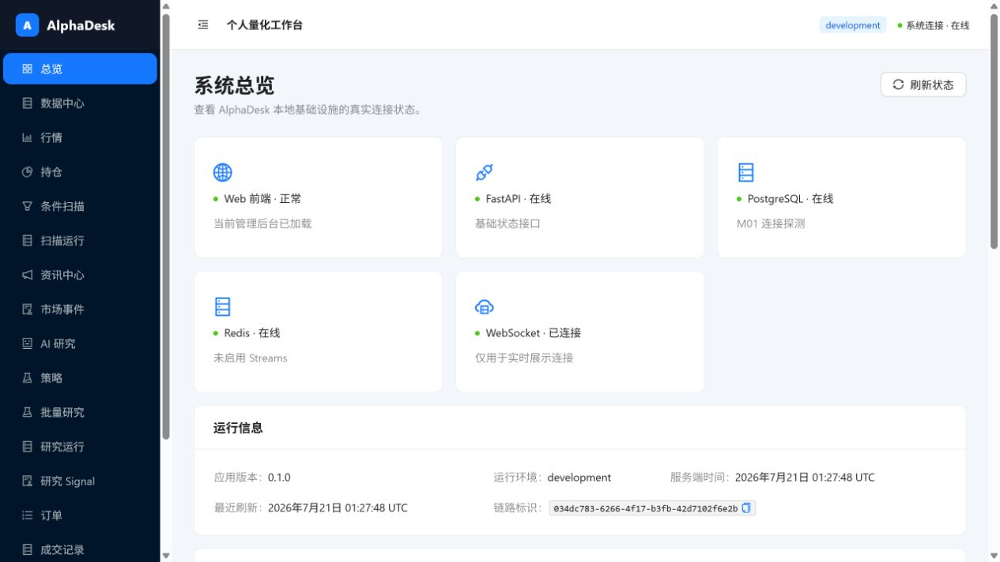
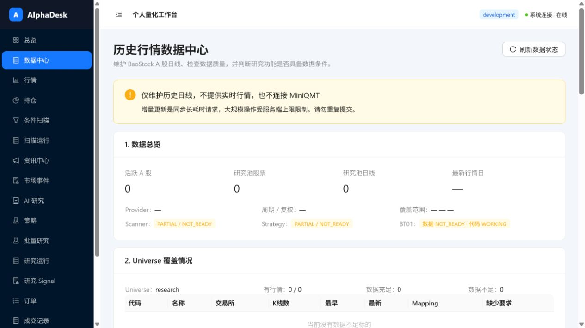
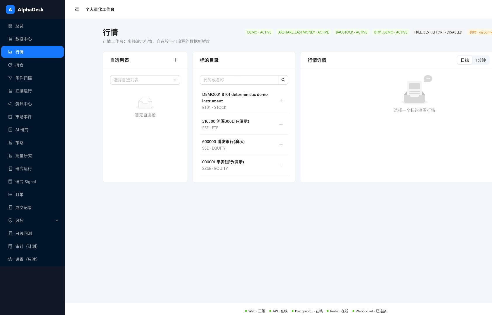
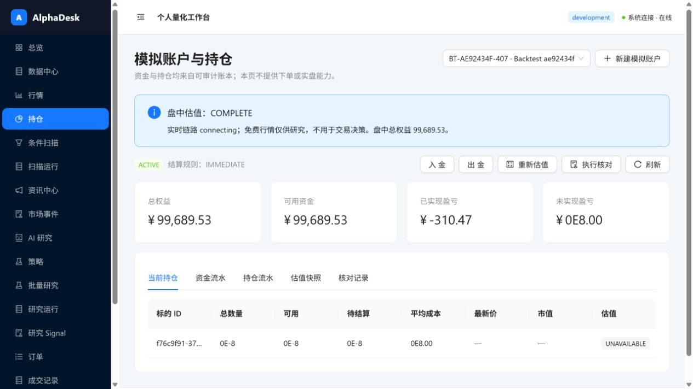
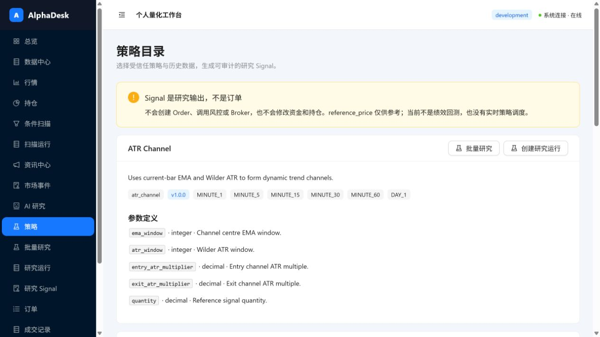
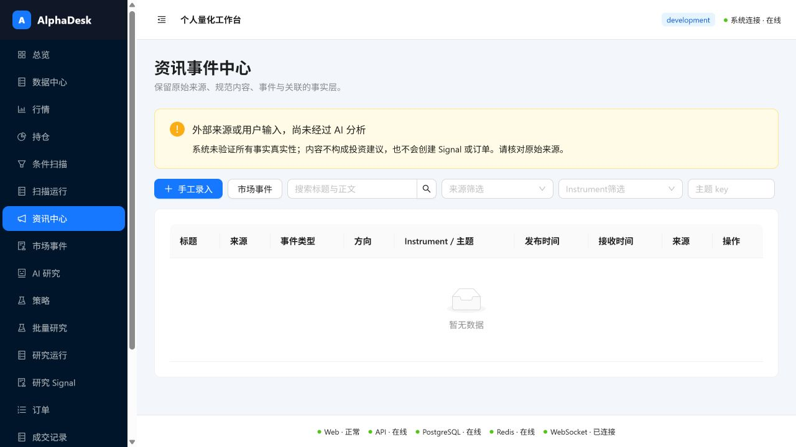
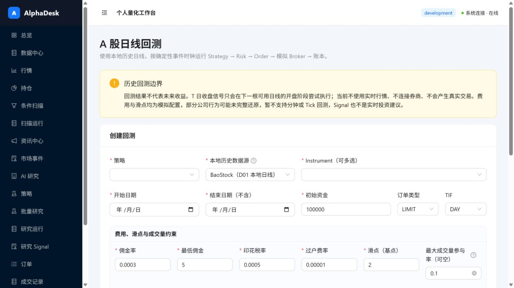
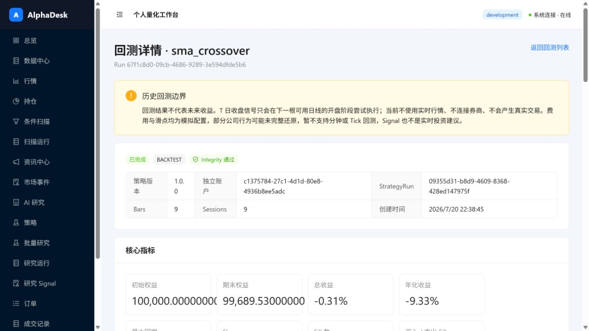

# AlphaDesk 使用指南

> 适用基线：MD01（2026-07-23）
> 适用对象：第一次使用 AlphaDesk，或不清楚页面按钮、数据前置条件和模块边界的用户。

AlphaDesk 当前是一个**仅供本地研究和模拟交易**的个人量化工作台。MiniQMT 已作为唯一正式
行情源接入目录、实时快照、历史日线和历史分钟线，但接入严格只读；系统仍未接入真实券商
交易、真实账户或实盘下单。

## 1. 先记住这条使用主线

```text
启动服务
  ↓
在“总览”确认 Web / API / PostgreSQL / Redis 在线
  ↓
准备基础数据（Instrument、历史日线）
  ↓
研究：行情 / 扫描 / 策略 / 回测
  ↓
模拟交易：模拟账户 → 风控 → 人工确认 → 模拟执行 → 成交与账本
```

如果一个页面是空的，通常不是按钮坏了，而是它所依赖的事实尚未建立。例如：

- 行情页面需要 Instrument、行情记录或自选列表；
- 扫描、策略和回测需要本地历史日线；
- 订单需要模拟账户和标的；
- AI 研究需要资讯事实以及已启用的 AI Provider；
- 实时行情需要 MiniQMT 已登录且 Windows 只读 Agent 正在运行。

## 2. 每次开机后的启动流程

### 2.1 启动 Docker Desktop

先启动 Windows 上的 Docker Desktop，等待它显示 Docker Engine 已运行。只打开浏览器不能启动 AlphaDesk。

### 2.2 在正确的项目目录打开 PowerShell

```powershell
cd "C:\Users\60576\Documents\Quantitative Sysytem"
```

如果在 `C:\Users\60576\Desktop` 直接运行 Git 或 Docker 项目命令，会出现“not a git repository”或找不到 Compose 文件。

### 2.3 启动 AlphaDesk

推荐使用 Docker Compose：

```powershell
docker compose up --build -d
docker compose ps
```

`docker compose ps` 中 PostgreSQL、Redis 和 API 应显示 `healthy`，Web 应显示正在运行。

也可以使用项目脚本：

```powershell
.\scripts\dev.ps1
.\scripts\dev.ps1 -Action status
```

### 2.4 打开页面

- AlphaDesk 网页：<http://127.0.0.1:5173/>
- FastAPI：<http://127.0.0.1:8000/>
- API 文档：<http://127.0.0.1:8000/docs>

`localhost` 与 `127.0.0.1` 在本机通常等价；如果其中一个受代理影响，可以尝试另一个。

### 2.5 停止服务

```powershell
docker compose down
```

这会停止容器，但保留 PostgreSQL 和 Redis 数据卷。**不要随意运行 `docker compose down -v`**，其中的 `-v` 会删除本地数据库和 Redis 数据。

## 3. 先看“总览”是否正常



总览页顶部和底部的状态含义：

| 状态 | 含义 | 异常时先做什么 |
| --- | --- | --- |
| Web 正常 | React 页面已经加载 | 刷新浏览器 |
| API 在线 | FastAPI 可访问 | 检查 `docker compose ps` 与 API 日志 |
| PostgreSQL 在线 | 业务事实可读写 | 等待健康检查，检查数据库容器 |
| Redis 在线 | 缓存/连接设施在线 | 检查 Redis 容器 |
| WebSocket 已连接 | 展示连接已建立 | 等待自动重连或刷新页面 |

向下滚动可以看到“功能可用性（后端权威检查）”。这里比“菜单是否能打开”更重要：

- `已实现 + 可用`：代码存在，当前数据和配置也满足条件；
- `已实现 + 不可用`：代码存在，但缺数据或配置；
- `部分完成`：只完成了一部分链路；
- `未实现`：当前版本不要尝试使用。

“刷新状态”只重新读取状态，不会自动导入数据或修复配置。

## 4. 第一次使用：先准备历史数据

### 4.1 数据中心怎么看



“数据中心”维护的是 AlphaDesk 本地保存的 MiniQMT 研究数据，不是多数据源选择页。关键区域：

1. **数据概况**：MiniQMT 连接、有效标的、日线、分钟线和最近同步时间；
2. **日线行情**：研究范围内哪些标的有足够日线；
3. **分钟行情**：1/5/15/30/60 分钟覆盖和真实 K 线预览；
4. **数据质量**：判断扫描、策略和回测是否具备数据条件；
5. **高级数据管理**：交易日历、复权因子、停复牌、生命周期和技术运行记录。

页面显示 `0`、`NOT_READY` 时，先完成首次初始化。为了避免误操作，首次全量步骤以 CLI 为主。

### 4.2 最快体验：建立确定性 Demo 数据

这条路线不联网，适合先体验日线回测：

```powershell
docker compose exec api python -m alphadesk_api.cli.backtests run-demo
docker compose exec api python -m alphadesk_api.cli.backtests list
```

完成后打开“日线回测”。Demo 数据带 `BT01_DEMO` 标识，只用于本地验收。

### 4.3 导入真实历史日线

先在“行情”页搜索并选择股票，再点“从 MiniQMT 补充历史行情”；也可在数据中心选择股票、
周期和日期后发起补数。Windows Agent 异步处理任务。

注意：

- 补数是受限、耗时的本机 MiniQMT 请求，不要反复点击；
- 系统不会默认下载全市场多年分钟数据；
- 数据是历史日线，不能当作实时成交价格；
- 补数不会自动创建 Signal、订单、成交或回测。

### 4.4 日常更新

交易时段内，Agent 会保存已订阅标的的 1 分钟 K 线并生成多周期聚合。Agent 启动或重连后
会自动修复当前订阅范围的小窗口缺口，交易日 15:10 后自动刷新日线；更大历史范围仍在
行情页或数据中心按需补数。完成后刷新数据中心并执行质量检查。

## 5. 左侧菜单速查

| 菜单 | 用途 | 使用前提 | 当前边界 |
| --- | --- | --- | --- |
| 总览 | 检查服务和模块可用性 | 服务已启动 | 只读状态 |
| 数据中心 | MiniQMT 日线、分钟线覆盖和质量 | MiniQMT + 本地数据库 | 不负责实时看盘 |
| 行情 | 股票搜索、自选、实时快照和 K 线 | MiniQMT + Agent | 只读行情，不可交易 |
| 持仓 | 模拟账户、资金、持仓和核对 | 模拟账户 | 不是真实账户 |
| 条件扫描 | 配置历史规则扫描 | 足量日线 | 结果不是投资建议 |
| 扫描运行 | 查询 ScanRun 和结果 | 已执行扫描 | 只读事实 |
| 资讯中心 | 手工录入或查看资讯事实 | 无强制行情前提 | 不自动验证真实性 |
| 市场事件 | 查看确定性事件事实 | 已有资讯/事件 | 不自动下单 |
| AI 研究 | 基于证据创建结构化研究 | 资讯 + 已启用 Provider | 默认 Provider 不可用/测试用 |
| 策略 | 查看内置策略并创建研究运行 | 历史日线 | Signal 不是订单 |
| 批量研究 | 比较参数组合 | 历史日线 | 不是资金回测 |
| 研究运行 | 查询 StrategyRun | 已创建研究运行 | 只读运行事实 |
| 研究 Signal | 查询策略输出 | 已产生 Signal | 不会自动变成订单 |
| 订单 | 创建、确认、取消、模拟执行 | 账户 + 标的 + 风控通过 | 不连接券商 |
| 成交记录 | 查看模拟 Fill 与费用 | 已模拟执行 | 只读模拟成交 |
| 风控 | 查看 RiskDecision 和限制 | 有风险评估/订单 | 当前为轻量规则 |
| 日线回测 | 完整历史日线模拟闭环 | 足量本地日线或 Demo | 无分钟/Tick/实盘 |
| 审计（计划） | 未来审计聚合入口 | — | 当前占位 |
| 设置（只读） | 查看非敏感运行配置 | 服务在线 | 不能在网页修改 |

## 6. 行情与自选股



页面分三栏：

1. **自选列表**：新建或选择 Watchlist；
2. **标的目录**：输入证券代码或名称搜索，例如 `600000`；
3. **行情详情**：选择标的后查看本地日线或已存在的行情记录。

输入代码后没有搜索结果，通常意味着 Instrument 目录尚未同步。标的能搜到但图表为空，通常意味着该标的尚未补历史日线。右上角出现 `实时 disconnected` 是当前安全基线的预期状态，不影响本地历史日线研究。

## 7. 模拟账户与持仓



推荐操作顺序：

1. 点击“新建模拟账户”；
2. 选择新账户；
3. 点击“入金”，建立模拟初始资金；
4. 在订单中心完成模拟成交；
5. 回到持仓页点击“刷新”或“重新估值”；
6. 用“资金流水”“持仓流水”核对变动；
7. 点击“执行核对”检查投影与追加账本是否一致。

几个易混概念：

- **总权益** = 现金 + 可估值持仓市值；
- **可用资金**是当前模拟账户可用于后续动作的现金；
- **已实现盈亏**来自已经卖出/结算的事实；
- **未实现盈亏**依赖可用行情估值；显示 `UNAVAILABLE` 时不是账本丢失，而是缺最新价；
- “入金/出金”只改变模拟账本，不涉及银行卡或真实券商。

## 8. 条件扫描与策略研究

### 8.1 条件扫描

在“条件扫描”中选择扫描器、研究股票池、截止时间和参数，再运行扫描。结果在“扫描运行”中查看。

当前扫描器使用历史日线做规则筛选。它不会调用风控、不会创建 Signal、不会创建订单，也不是实时盯盘器。

### 8.2 策略目录



内置策略包括 SMA Crossover、ATR Channel、Trend Pullback、Volume Breakout 等。每张策略卡片显示：

- 策略 key 与版本；
- 支持周期；
- 参数名、类型和含义；
- “创建研究运行”和“批量研究”入口。

“创建研究运行”会读取历史行情并生成可审计的 `StrategyRun` 和 `Signal`。这里的 Signal 是研究事实，**不会自动通过风控或变成订单**。

“批量研究”适合比较多组参数。它比较 Signal 数量和输出差异，不等同于含资金、费用、滑点和成交约束的完整回测；要看收益与回撤，应使用“日线回测”。

## 9. 资讯、市场事件与 AI 研究



### 9.1 资讯中心

点击“手工录入”，填写标题、正文、来源、发布时间，以及可选的 Instrument/主题。保存后系统保留原始来源和规范化事实。

### 9.2 市场事件

“市场事件”显示由用户输入或确定性规则形成的事实。页面为空时，先在资讯中心录入一条内容；它不会自动从互联网抓取全部新闻。

### 9.3 AI 研究

AI 研究必须选择已有资讯或市场事件作为证据。当前默认 Provider 可能显示 `disabled`，`fake` Provider 仅供测试；真实模型 Provider 尚未正式接线。因此：

- 页面能打开不代表真实 AI 已启用；
- 没有证据记录时下拉框会为空；
- AI 输出只供研究参考，不创建 Signal、订单、成交或持仓；
- 必须通过 Evidence 链接回看原始事实。

## 10. 模拟订单、风控与成交

这是一个安全门明确的本地模拟流程：

```text
创建订单意图
  → 服务端 R01 风控
  → PASS 后生成 WAITING_CONFIRMATION
  → 用户人工确认
  → 输入手工市场快照并模拟执行
  → Fill + 资金账本 + 持仓账本
```

推荐步骤：

1. 在“持仓”中新建模拟账户并入金；
2. 在“订单”点击“创建订单”；
3. 选择账户、标的、买卖方向、订单类型、数量和必要价格；
4. 提交后查看 RiskDecision；
5. 只有 `PASS` 才会创建等待确认的 Order；
6. 检查内容后人工确认；
7. 在订单详情输入仅供测试的市场快照，显式执行模拟成交；
8. 到“成交记录”和“持仓”核对 Fill、费用、现金和持仓流水。

状态含义：

- `REJECT`：风控拒绝，不创建订单；
- `REVIEW`：需要处理风险条件，不会自动绕过；
- `WAITING_CONFIRMATION`：等待人工确认；
- `QUEUED/PENDING`：本地事实已排队，**不代表已发给券商**；
- `FILLED/PARTIALLY_FILLED`：只代表本地模拟 Broker 结果。

不要把历史收盘价、免费行情或手工快照当作真实可成交价格。

## 11. 日线回测

### 11.1 创建回测



填写顺序：

1. **策略**：选择内置策略；
2. **本地历史数据源**：真实历史研究选 BaoStock；快速体验可先用 Demo 数据；
3. **Instrument**：可多选，但必须在日期范围内有足量日线；
4. **开始日期 / 结束日期（不含）**：结束日期本身不进入回测；
5. **初始资金**：这是回测独立账户，不修改平时的模拟账户；
6. **订单类型 / TIF**：确定模拟订单行为；
7. **费用、滑点与成交量参与率**：决定成交成本和成交约束；
8. **策略参数**：必须满足策略的类型和范围校验；
9. **幂等键**：重复提交同一请求时避免重复创建；要运行新实验请点“生成新键”；
10. 点击“同步运行回测”，等待完成后在下方记录中进入详情。

回测的关键时间规则：T 日收盘产生的 Signal，最早只会在**下一根可用日线的开盘阶段**尝试成交。这是为了避免使用未来数据。

### 11.2 读懂结果



详情页先看三类信息：

- **Integrity 通过**：事实数量、顺序和关联通过完整性检查；它不代表策略一定盈利；
- **收益指标**：初始/期末权益、总收益、年化收益、最大回撤；
- **执行指标**：Signal、RiskDecision、Order、Fill、费用和拒绝情况。

常见误区：

- 总收益为负不表示软件有故障，只表示该策略、参数和样本结果为负；
- 年化收益在很短样本上会被放大，不应单独解读；
- 没有 Fill 可能是无 Signal、风控拒绝、价格条件不满足或没有下一根 K 线；
- 回测结果不代表未来收益，也不会产生真实交易。

## 12. 常见问题排查

### 网页完全打不开

```powershell
cd "C:\Users\60576\Documents\Quantitative Sysytem"
docker compose ps
docker compose up --build -d
```

如果提示无法连接 Docker API，先启动 Docker Desktop。如果 5173 或 8000 端口被占用，修改 `.env` 中的 `WEB_PORT` / `API_PORT`，或停止占用端口的程序。

### 网页打开，但顶部显示“系统连接：离线”

访问 <http://127.0.0.1:8000/health/ready>。若失败：

```powershell
docker compose logs --tail 100 api
docker compose ps
```

数据库或 Redis 仍在启动时，等待健康检查后再刷新总览。

### 行情、扫描、策略或回测没有数据

按以下顺序检查：

1. 数据中心是否有研究池股票；
2. 是否有日线数量和最新行情日；
3. Readiness 是否为 READY；
4. 日期范围内是否有足够 K 线；
5. 数据源、周期与复权口径是否匹配。

### 市场事件为空

先在“资讯中心”点击“手工录入”建立一条资讯事实。系统当前不会自动为你填充所有新闻。

### AI 研究不可用

检查是否已经有 InformationItem/MarketEvent，以及 Provider 是否启用。默认 `disabled` 是安全配置；`fake` 只用于测试，当前不要把它当成真实 AI 分析。

### 实时行情显示 disconnected

确认 MiniQMT 已登录行情入口、Windows 只读 Agent 正在运行、Redis/API 在线。WebSocket
断开时页面不会改用其他行情源；已显示的实时价格可能过期，历史 K 线仍可查看。

### 订单创建失败

检查模拟账户、入金、Instrument、数量/价格格式和风控结果。`REJECT` 或 `REVIEW` 不会创建 Order，系统也不会自动绕过规则。

### 回测一直没有成交

检查策略是否产生 Signal、结束日期之后是否还有下一根可执行 K 线、订单价格条件、风控结果、最大成交量参与率和账户现金。

## 13. 每日使用清单

开始使用：

```text
□ Docker Desktop 已运行
□ MiniQMT 已登录行情入口
□ docker compose up --build -d
□ Windows 只读行情 Agent 已运行
□ 总览五项基础状态正常
□ 需要研究时先检查数据中心最新行情日
□ 缺少历史数据时只从 MiniQMT 发起补数
```

结束使用：

```text
□ 长耗时补数或回测已经结束
□ 必要结果已在页面或数据库中确认
□ docker compose down（保留数据）
□ 不使用 docker compose down -v
```

## 14. 当前版本的明确限制

- MiniQMT 当前只有只读行情 Agent，没有交易执行器；
- 没有真实券商、真实账户或实盘下单；
- 实时行情依赖本机 MiniQMT 登录、行情权限和 Agent 在线；
- AI 真实 Provider 尚未正式接线；
- 分钟/Tick 回测尚未实现；
- “审计（计划）”仍是占位入口；
- “设置（只读）”不能修改运行配置；
- 当前没有认证，不得把服务暴露到不可信网络。

有关模块内部规则和开发契约，请从 [文档索引](index.md) 继续阅读。
